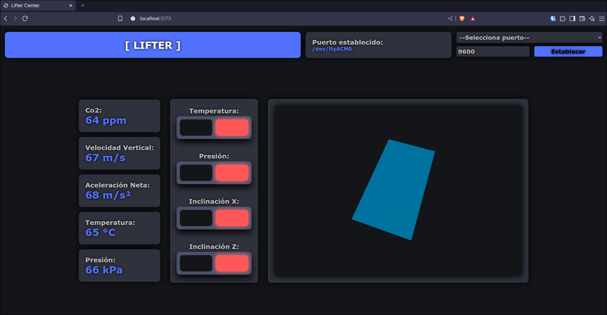

# Estación Terrena [LIFTER]
---

> **Desarrollo de aplicación web para CanSat "LIFTER"**
> 

## Índice
1. [Requisitos previos](#requisitos-previos)  
2. [Cómo ejecutar el sistema](#cómo-ejecutar-el-sistema)  
3. [Dependencias](#dependencias)  
4. [Modo de operación](#modo-de-operación)  

## Requisitos previos
Node.js	 · probado en v23.11.1 - https://nodejs.org/en/download

    node -v	

npm (incluido con Node)

    node -v	

> Si los comandos anteriores no devuelven un número de versión, instala Node.js desde el enlace oficial (incluye npm).

## Cómo ejecutar el sistema

1.Instalación de dependencias
> Desde el directorio raíz, ejecuta:

    npm run setup

2.Arranque de servicios
> Inicia backend y frontend en paralelo:

    npm run start

3.Conexión del Arduino
> - Toma un Arduino a la mano y sube el sketch simulation-sketch.ino.
> - Conecta tu Arduino y cambia el puerto si es necesario (mantén 9600 baudios).

4.Apertura de la interfaz gráfica
> Abre un navegador con soporte WebGL (Chrome, Firefox, Edge, etc.) y visita:
http://localhost:5173

## Dependencias

Back-end (Node.js v23.11.1)

| Paquete      | Versión | Propósito                                                             |
| ------------ | :-----: | --------------------------------------------------------------------- |
| express      |  5.1.0  | Levantar la aplicación HTTP                                           |
| serialport   |  13.0.0 | Detectar puertos, abrir el seleccionado y delimitar cada línea serial |
| socket.io    |  4.8.1  | Emitir datos parseados al frontend mediante WebSockets                |
| concurrently |  9.1.2  | Lanzar backend y frontend en paralelo con un solo comando             |
| standard     |  17.1.2 | Reglas ESLint preconfiguradas para código uniforme                    |
| fs (núcleo)  |    —    | Escribir un archivo `.txt` con los datos formateados                  |

Front-end (React 19 + Vite)

| Paquete            | Versión | Propósito                                       |
| ------------------ | :-----: | ----------------------------------------------- |
| react              |  19.0.0 | Construcción de componentes y gestión de estado |
| @react-three/fiber |  9.1.2  | Renderizado 3D del CanSat y rotaciones en vivo  |
| socket.io-client   |  4.8.1  | Conexión WebSocket con el backend               |

## Modo de operación

Captura de datos

    - El módulo LoRa receptor en el Arduino de la estación terrena recibe los paquetes enviados desde el CanSat.

    - El Arduino reenvía la información a la computadora mediante USB (comunicación serial).

Procesamiento en el backend

    - Un servidor Express + Socket.io gestiona la API HTTP y la comunicación en tiempo real.

    - Serialport abre el puerto y recibe un flujo continuo de bytes sin delimitación clara.

    - Cada mensaje se separa por \n y se envía a un parser que espera seis líneas: temperatura, presión, CO₂, aceleración neta, velocidad vertical y rotaciones.

    - Al reunir los seis valores:

        - Se genera un objeto JSON clave–valor.

        - Se agrega una entrada al archivo .txt como registro.

        - Se emite el JSON a todos los clientes WebSocket.

Visualización en el frontend

    - El cliente React se conecta con socket.io-client y recibe los nuevos paquetes.

    - Los datos se distribuyen entre componentes modulares:

    - Indicadores numéricos y gráficas.

    - Vista 3D del CanSat (React Three Fiber) que rota en tiempo real según los ángulos recibidos.
